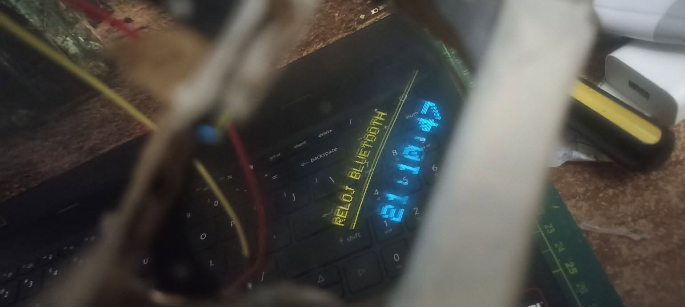

<!-- ESTE ES UN COMENTARIO Y NO SE VERÁ: Puedes borrar estas líneas si quieres. 
He diseñado este README para que se vea genial. ¡Solo sigue las instrucciones en mayúsculas!
-->

# ¡Hola mundo! 👋 Soy Jesús Eduardo Vázquez Barba

  <!-- BANNER PRINCIPAL -->
  <!-- INSTRUCCIÓN: He generado un banner genial abajo. Descárgalo de la respuesta y súbelo a una carpeta 'images' en este repo, o usa una URL externa. Si no tienes una, usa la imagen por defecto que te proporciono aquí (déjala como está). -->
  

## 🛠️ Mi Stack Tecnológico

<!-- INSTRUCCIÓN: Estas insignias (badges) son imágenes estáticas. Puedes añadir o quitar usando la sintaxis:

Busca logos en simpleicons.org -->

### Lenguajes

### Frameworks & Herramientas

---
## 🚀 Sobre Mí

Soy un/a apasionado/a **[Tu Rol Actual, ej: Desarrollador Full Stack / Estudiante de IA]** de **[Tu Ciudad/País]**. Me encanta resolver problemas complejos y construir soluciones elegantes que impacten positivamente en la vida de las personas.

*   🔭 Actualmente trabajando en: **[Nombre de tu proyecto principal o 'Proyectos Personales']**
*   🌱 Aprendiendo constantemente sobre: **[Tecnología nueva que estudias, ej: Rust, Kubernetes]**
*   👯 Busco colaborar en: Proyectos de **[Código abierto / Apps móviles / Web]**
*   💬 Pregúntame sobre: **[Tus temas fuertes, ej: React, Python, Arquitectura]**
*   ⚡ Dato curioso: **[Algo divertido sobre ti, ej: "He corrido 3 maratones" o "Prefiero el modo oscuro siempre"]**

 

## 📈 Mis Estadísticas de GitHub

<!-- INSTRUCCIÓN: Estas imágenes son DINÁMICAS. Funcionan solas.
IMPORTANTE: Debes cambiar 'TU_USUARIO_AQUI' por tu nombre de usuario real de GitHub en las dos URLs de abajo para que muestren TUS datos. -->

  
  

  

---

## 🤝 Conecta Conmigo

<!-- INSTRUCCIÓN: Cambia las URLs por tus perfiles reales. He incluido LinkedIn y Twitter/X. -->

  
  
  

  Hecho con ❤️ y Markdown por <a href="https://github.com/TU_USUARIO_AQUI">[Tu Nombre]</a>.

