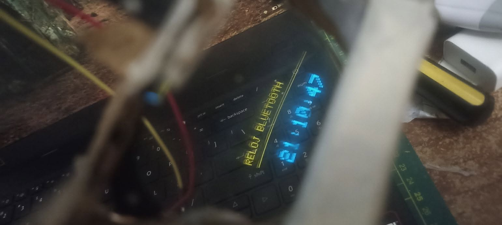

  <h1>Hola, soy Jesús Eduardo Vázquez 👋</h1>
<picture></picture>
  

  

    
  

---

### 🚀 Sobre Mí / About Me

Passionate software developer driven by curiosity and problem-solving. I believe coding allows us to build creative solutions while embracing technical ownership and continuous growth.

- 💼 **Status:** Open to new opportunities & exciting projects
- 🛠️ **Focus:** Full-Stack Web Development, REST APIs & Embedded Systems
- 🌱 **Currently exploring:** Cloud Architectures (AWS) & Advanced Backend Patterns
- 💬 **Ask me about:** Python, JavaScript/TypeScript, Node.js, React, or IoT with ESP32/Arduino
- ⚡ **Fun Fact:** I once ran a full marathon! 🏃‍♂️💨

---

### 🛠️ Tech Stack & Toolbox

#### 🌐 Languages

#### ⚙️ Frameworks & Backend

#### 🗄️ Databases, Cloud & Tools

#### 🔌 Hardware & IoT

---

## <picture>   </picture> Github Stats

 

  
  

   
  

---

### 🤝 Conectemos / Get in Touch

  
  

    
  ⚡ Diseñado con código, pasión y café.

